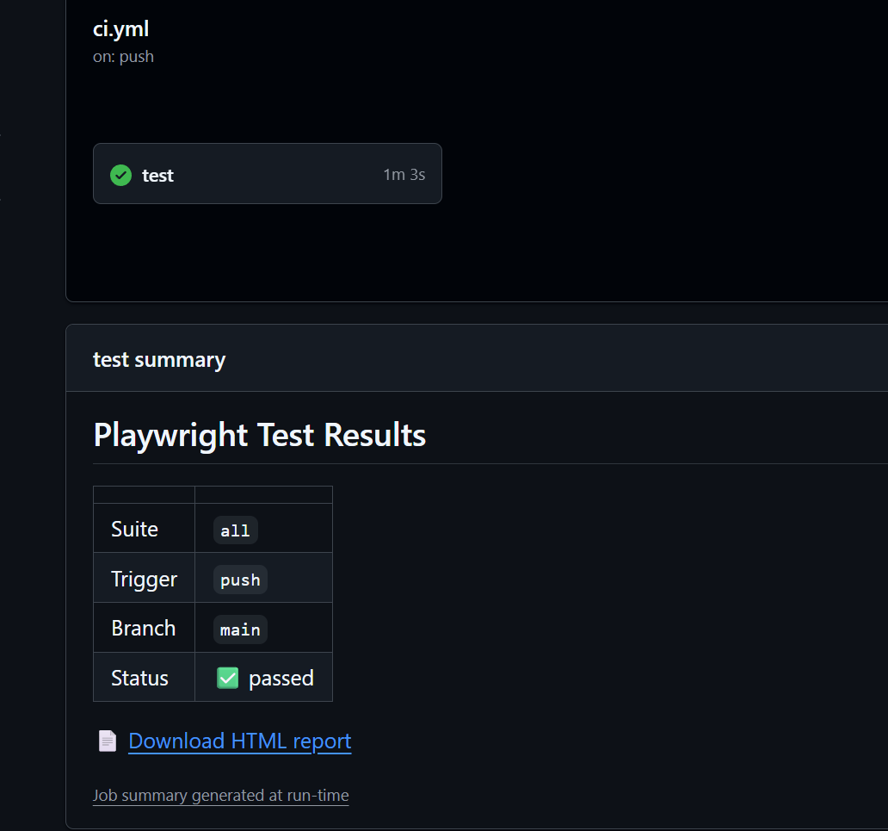

# Moxymind Automation — Tasks #1 & #2

Automated tests for [SauceDemo](https://www.saucedemo.com) (frontend) and [ReqRes](https://reqres.in) (API) built with **Playwright** and **TypeScript**.

## Tech stack

- [Playwright](https://playwright.dev/) — test framework
- TypeScript — language
- Page Object Model — frontend architecture pattern
- GitHub Actions — CI pipeline

## Architecture decisions

- **Page Object Model** — UI interactions are encapsulated in page classes, keeping tests readable and selectors in one place
- **Separate projects** (`frontend` / `api`) — different base URLs, reporters, and configs without interference
- **Data-driven tests** — external test fixtures in `test-data/` so payloads are easy to extend without touching test logic
- **Tags** (`@ui` / `@api`) — allow selective runs locally and via CI `workflow_dispatch` dropdown

## Task #1 — Frontend (SauceDemo) `@ui`

- **Successful login** — entry point of the app; a broken login blocks everything
- **Locked out user error** — validates access control and proper error messaging
- **Add / remove from cart** — core e-commerce interaction
- **Complete checkout flow** — the primary business path; a broken checkout means direct revenue loss

## Task #2 — API (ReqRes) `@api`

- **GET /api/users?page=2** — validates pagination, data shape, field types, and total count
- **POST /api/users** (data-driven × 3) — validates creation status, response schema, and response time

## Project structure

```
pages/            Page Object classes (LoginPage, InventoryPage, CartPage, CheckoutPage)
tests/
  frontend/       @ui tests (authentication, cart & checkout)
  api/            @api tests (reqres)
test-data/        Test fixtures (user credentials, API payloads)
.github/          CI pipeline (GitHub Actions)
playwright.config.ts
```

## How to run locally

```bash
npm install
npx playwright install
```

Run all tests:
```bash
npm test
```

Run by tag:
```bash
npx playwright test --grep @ui
npx playwright test --grep @api
```

Run frontend tests only:
```bash
npm run test:frontend
```

Run API tests only:
```bash
npm run test:api
```

Run with visible browser:
```bash
npm run test:headed
```

Run in interactive UI mode:
```bash
npm run test:ui
```

Open HTML report after run:
```bash
npm run report
```

Debug a specific test step-by-step in Playwright Inspector:
```bash
npm run test:debug
```
To focus on one test, add `.only` directly in the file before running:
```typescript
test.only('should login successfully...', async ({ page }) => {
```
This opens Playwright Inspector — you can step through each action, inspect selectors, and see the browser state in real time.

## API key (ReqRes)

API tests work without a key (free tier). To use an authenticated key, create a `.env` file:

```bash
cp .env.example .env
# edit .env and add your key from https://app.reqres.in/api-keys
```

## CI

Tests run automatically on every push and pull request via GitHub Actions.

To trigger manually, use the **Run workflow** button on the Actions tab in GitHub — select the suite from the dropdown.

The HTML report is uploaded as an artifact after each run (pass or fail).

Each run generates a **Job Summary** with status, trigger info, and a direct link to the report:


