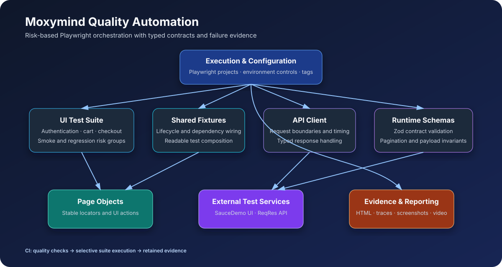

# Moxymind Quality Automation

[](https://github.com/dmytropogribnyy/moxymind-automation/actions/workflows/ci.yml)

Moxymind Quality Automation is a production-style Playwright and TypeScript framework for validating critical retail journeys and REST API contracts. It combines risk-based UI coverage, typed API checks, runtime schema validation, failure evidence, selective execution, and CI reporting in one maintainable test system.

SauceDemo and ReqRes are public external test services used as automation targets. They are not clients, products, or commercial engagements of the repository owner.

## At a glance

| Capability            | Implementation                                                                                 |
| --------------------- | ---------------------------------------------------------------------------------------------- |
| Critical retail flow  | Login → cart → customer details → order summary → completion                                   |
| UI risk coverage      | Authentication, access control, session logout, sorting, cart state, required fields, checkout |
| API contract coverage | Pagination, status and headers, typed payloads, runtime schemas, negative response, timestamps |
| Execution model       | Independent `ui` and `api` Playwright projects with smoke, critical, and regression tags       |
| Quality controls      | ESLint, Prettier, strict TypeScript, `forbidOnly` in CI, bounded retries                       |
| Evidence              | HTML reports, traces, screenshots, videos, API timing attachments, GitHub Job Summary          |
| CI                    | Pull requests, pushes to `main`, and manual selective suite execution                          |

## Business risks covered

The suite is intentionally compact and prioritizes failure modes that would materially affect a retail experience or an API consumer:

- valid users cannot enter the product area;
- blocked accounts bypass access controls or receive unclear feedback;
- logout leaves a reusable authenticated session;
- product ordering is inconsistent with the selected sort option;
- cart state does not reflect add or remove actions;
- checkout accepts incomplete customer information;
- order summary content diverges from the selected item;
- core API endpoints violate status, header, pagination, payload, or timestamp contracts;
- unknown API resources do not return the expected negative response.

## Quality coverage

### UI journeys

The `ui` project currently contains seven named scenarios:

- standard-user authentication (`@smoke`, `@critical`);
- locked-out user denial;
- logout and protected-route session behavior;
- cart add/remove state;
- inventory price sorting;
- missing required checkout information;
- end-to-end purchase completion with order-summary checks (`@smoke`, `@critical`).

Selectors and UI actions are encapsulated in focused Page Objects. Business assertions remain visible in the tests so failures are understandable from the Playwright report without opening framework internals.

### API contracts

The `api` project currently contains five named scenarios:

- paginated user-list contract (`@smoke`, `@critical`);
- unknown-user `404` behavior;
- three independently reported data-driven user-creation contracts.

A typed ReqRes client owns request boundaries. Zod schemas validate runtime response shape and invariants before test-level assertions inspect status codes, content type, uniqueness, echoed payloads, and timestamp validity.

## Architecture



```text
config/                 typed environment and reliability controls
clients/                external API request boundaries
schemas/                runtime API contracts and inferred TypeScript types
fixtures/               shared Playwright dependency wiring
pages/                  UI locators and actions
pages/                  focused SauceDemo Page Objects
test-data/              users, products, customer details, API payloads
tests/
  ui/                    retail journey coverage
  api/                   REST contract coverage
utils/                   evidence and observability helpers
docs/                    engineering strategy and CI guidance
.github/workflows/       validation and selective execution
```

Detailed decisions are documented in [Architecture](docs/architecture.md).

## Test strategy

The framework uses three practical execution groups:

- **Smoke (`@smoke`)** — fast confidence in authentication, purchase completion, and the principal API listing contract.
- **Critical (`@critical`)** — release-relevant paths whose failure blocks the main user or integration outcome.
- **Regression (`@regression`)** — access control, session handling, validation, sorting, cart state, negative API behavior, and data variations.

UI tests validate browser behavior that requires rendering and interaction. API tests validate transport and contract behavior without duplicating UI journeys. Shared test data is typed and centralized, while each data-driven API payload remains a separate Playwright test so failures are not hidden inside loops.

See [Test Strategy](docs/test-strategy.md) for scope boundaries and release-confidence criteria.

## Reliability and flakiness controls

- role and `data-test` locators instead of CSS layout coupling;
- Playwright auto-waiting with no arbitrary sleeps;
- isolated browser contexts and independent API request contexts;
- one retry in CI and zero retries locally;
- two CI workers to limit contention against public services;
- `forbidOnly` enabled in CI;
- traces, screenshots, and videos retained only for failures;
- external API latency recorded as report evidence by default;
- response-time failure enabled only through the explicit `API_PERFORMANCE_GATE=true` control.

The optional API timing threshold is a diagnostic contract for controlled environments. It is not presented as load, stress, capacity, or production performance testing.

## CI/CD workflow

The GitHub Actions workflow runs on:

- pull requests;
- pushes to `main`;
- manual `workflow_dispatch` execution.

Manual runs can select `all`, `smoke`, `ui`, or `api`. The workflow uses minimal read-only repository permissions, dependency caching, concurrency cancellation, Chromium-only UI execution, and bounded timeouts.

The final validation path is:

```text
npm ci
  → lint
  → format check
  → typecheck
  → selected Playwright suite
  → HTML report and failure evidence
  → GitHub Job Summary
```

[View workflow runs](https://github.com/dmytropogribnyy/moxymind-automation/actions/workflows/ci.yml)

## Evidence and reporting

Each CI run can publish:

- a Playwright HTML report for test results and steps;
- trace archives for failed browser tests;
- failure screenshots and retained videos;
- structured API timing attachments;
- a GitHub Job Summary showing suite, trigger, commit, and result;
- `test-results` artifacts only when diagnostics are required.

Generated reports are not committed as source. They remain attached to the exact workflow run that produced them, preserving the connection between code revision and evidence. More detail is available in [CI and Evidence](docs/ci-and-evidence.md).

## Technology stack

- Playwright Test;
- TypeScript in strict mode;
- Zod runtime validation;
- ESLint flat configuration;
- Prettier;
- GitHub Actions;
- Node.js 20+.

## Local execution

```bash
npm ci
npx playwright install chromium
cp .env.example .env
```

The API key is optional at framework level and can be supplied when the external ReqRes access mode requires it:

```bash
REQRES_API_KEY=your_key
```

### Commands

```bash
npm run lint
npm run format:check
npm run typecheck
npm run test:smoke
npm run test:critical
npm run test:ui
npm run test:api
npm run test:all
npm run test:headed
npm run test:runner
npm run report
```

### Environment controls

| Variable                         |                     Default | Purpose                                      |
| -------------------------------- | --------------------------: | -------------------------------------------- |
| `SAUCEDEMO_BASE_URL`             | `https://www.saucedemo.com` | UI target override                           |
| `REQRES_BASE_URL`                |         `https://reqres.in` | API target override                          |
| `REQRES_API_KEY`                 |                       empty | Optional external-service credential         |
| `API_PERFORMANCE_GATE`           |                     `false` | Explicitly enable response-time failure      |
| `API_RESPONSE_TIME_THRESHOLD_MS` |                      `2000` | Threshold used only when the gate is enabled |

## Engineering ownership

Changes are expected to preserve clear test intent, typed boundaries, deterministic assertions, and useful failure evidence. New scenarios should map to a concrete risk rather than increase test count for its own sake.

- Contribution workflow: [CONTRIBUTING.md](CONTRIBUTING.md)
- Security reporting: [SECURITY.md](SECURITY.md)
- Engineering portfolio: [dmytropogribnyy.github.io](https://dmytropogribnyy.github.io/)

## Honest limitations

- SauceDemo and ReqRes are externally operated services; availability, data, authentication requirements, and latency can change independently of this repository.
- Chromium is the default browser target to keep CI focused and economical; cross-browser confidence requires a separately justified execution profile.
- The suite validates representative high-risk behavior, not exhaustive product coverage.
- API timing observations are single-request diagnostics, not evidence of production performance or scalability.
